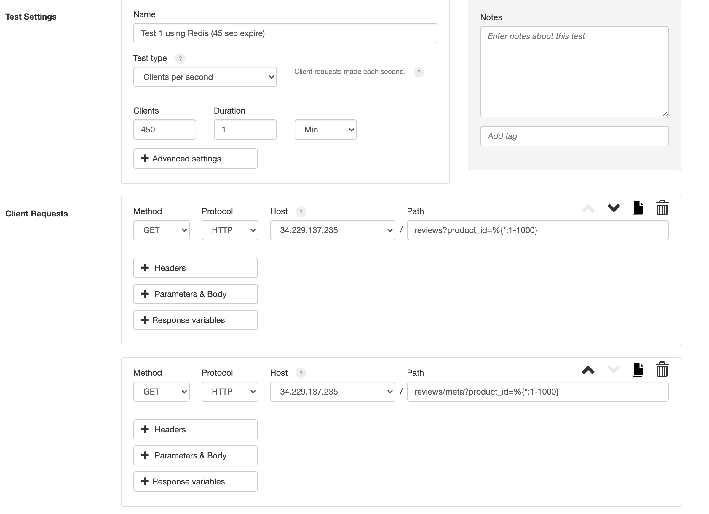
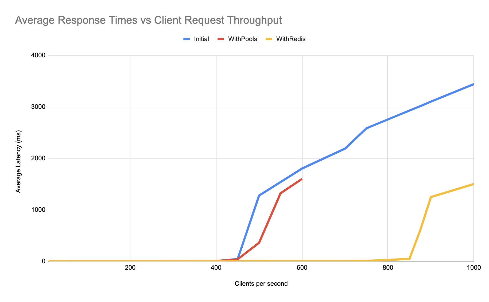

# Atelier API (Reviews)
Welcome to the API set up to handle front end requests for Reviews and Ratings information for a mock e-commerce website! Follow the instructions below if you would like to use this repo.

## Usage (without Kubernetes)
Ensure docker and docker-compose are installed on machine in use.

Then simply run `docker-compose up -d` to start up the DB and API in detached mode in the root directory (directory with docker-compose.yml file).

To stop these two, run `docker-compose stop` in the root directory.

If you'd like to check out the Kubernetes set up, I will add a README in a kubernetes folder later on detailing the steps I took to set up this API in a cluster.

## Environment Setup
There are a few files that are ignored on this GitHub repo that you will need to appropriately start up this API:
* A config.js file with the given path "reviews_api/database/sqlHelperscripts/config.js". This will have the DB information such as host, port, database, user, and password, as well as the path to the csv's on your machine.
* A config.js file with the given path "reviews_api/server/config.js" that has all the DB info as the above mentioned config, but doesn't need the CSV path. It also has the Express server port, the Redis Host and the Redis Port.
* Lastly, a .env file located at the same level of this README, which only has one variable, which is an EXPOSED_PORT that is used in the docker-compose.yml file so that we can adjust what port our Express server is accessible on.
* You will also need Nodejs installed on your machine to run most of these commands

## ETL
The data stored in the database will not be there automatically. To upload the data, make sure you have access to the 4 CSV's and the appropriate environment set up detailed in the previous section.

Once you have the database config file correctly updated, you begin by running the Nodejs scripts for all of the loaders (The last CSV will take a while to load):
* `npm run loadAll`

After these have loaded, join two of the tables, add the indexes to greatly improve query times, initialize the meta data table, and ensure the serial value is correct for when we add reviews to the DB via POST requests. This can all be done by running the one script below (Depending on your machine, these scripts can take upwards of half an hour to finish. Just make sure your console is giving you responses):
* `npm run cleanDB`

After that, the DB should be up and ready to go! If you'd like to understand what these scripts are doing, check out the package.json in the root directory to explore more.

## Performance Metrics

Here are a couple of screenshots detailing the performance of the API as I used Loader.io to stress test with varying amounts of throughput.

/redis850cpsRange1000.png)
Above is an example test from Loader.io

Above is an example of the setup for one of the Loader.io tests

Above is a graph detailing the average response times in all of the tests I ran to find the point at which the API was overloaded under various circumstances